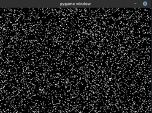

# Fluid_Sim
A simulation in python using either numpy or cupy that simulates an incompressible newtonian fluid.

# Install
Use `pip install -r requirements.txt` to install the necessary packages. **Note** If you do not have a gpu that supports cuda, you can straight away remove cupy from the `requirements.txt`. The simulator will fall back to using the cpu (numpy) for simulation.

# Use

Drag the fluid with your mouse:

You can change parameters such as the simulation and window resolution in the `main.py` file. You can also experiment with different simulation parameters by providing a dictionary via the `sim_params` keyword argument to the constructor of the `sim` object in `main.py` (see `DEFAULT_PARAMS` in `/simulator/simulator.py` for an example).

I will probably add a better user interface and more features in the future.
